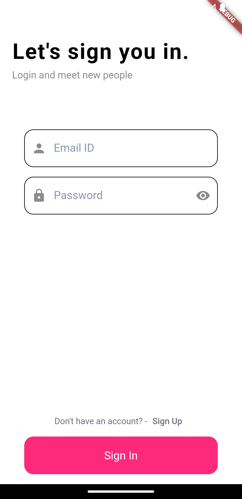
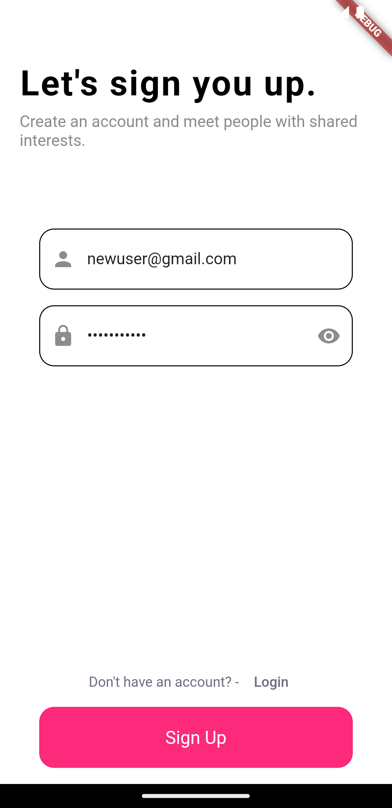
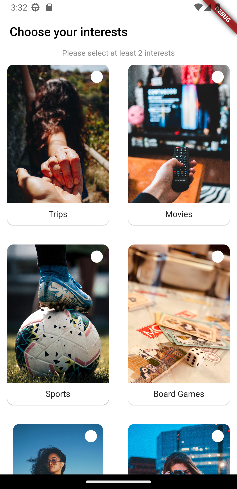
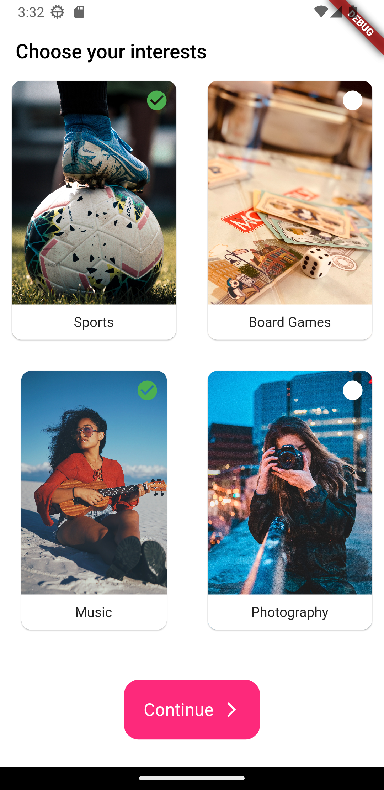
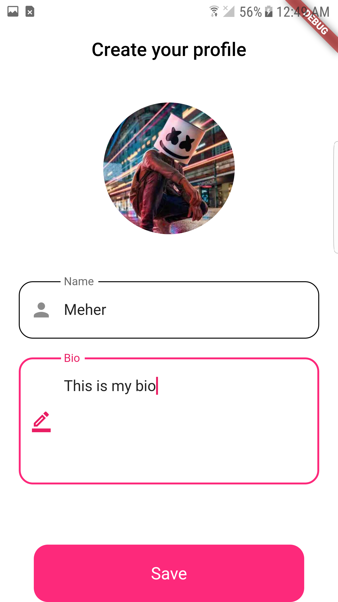
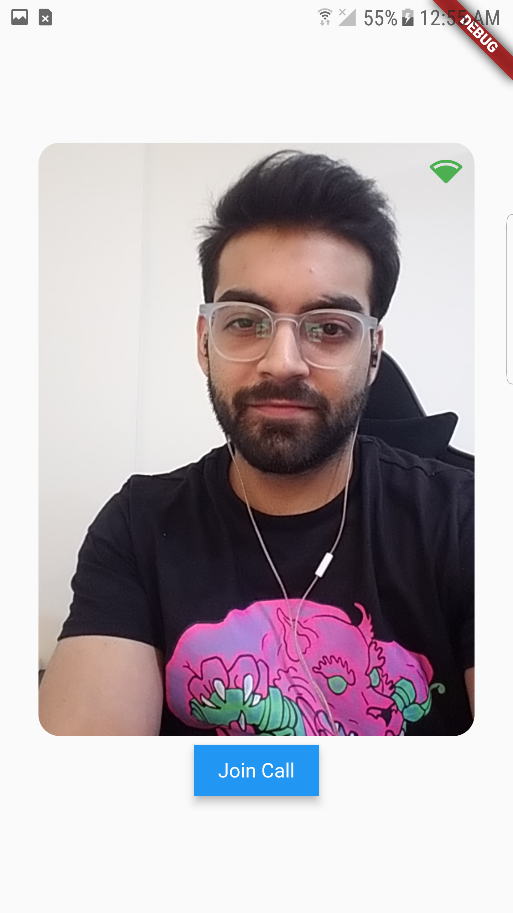
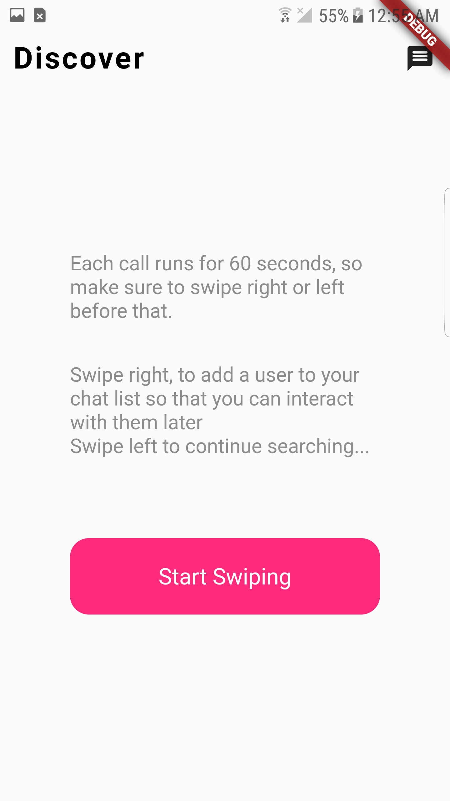
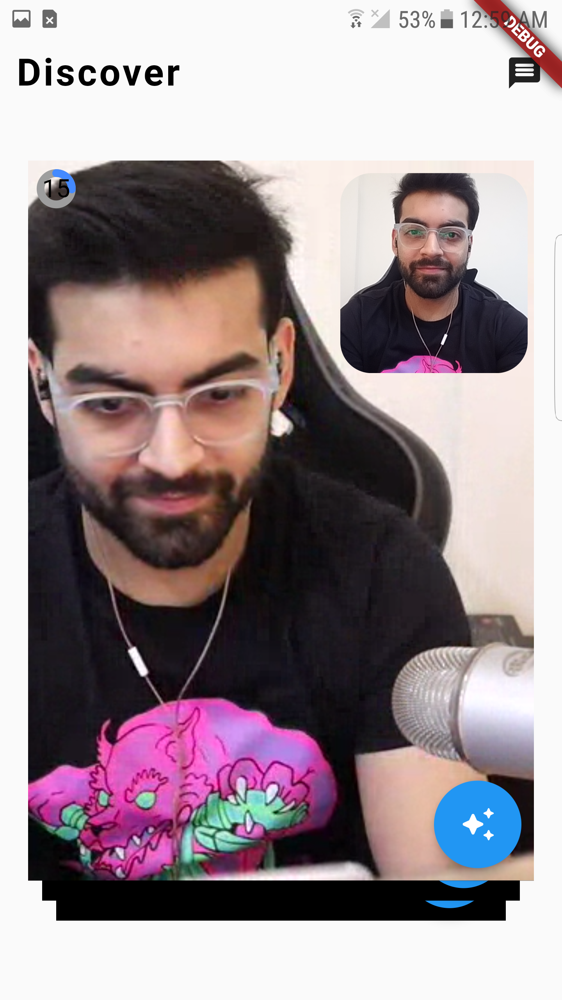
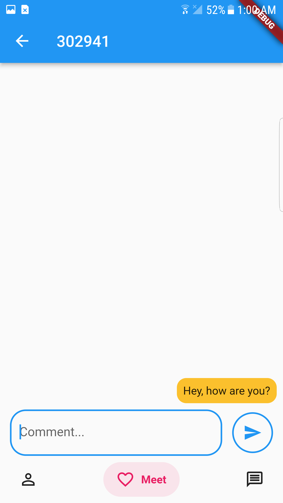

# Build Your own Dating app with Agora

This guide walks you through building your own tutoring application. This application will allow you to signup as an individual and match with other users based on similar interests. We currently use an array of hobbies that a user can be interested in and we match user that have more than 80% profile overlap (this can be customized as per your use-case). The users are connected via a short 60 seconds video, where both the users can make their impression and decide on whether they want to continue talking post video call. This will be a complete application including authentication, user management, and tons of real-time features.

- [Build Your own Dating app with Agora](#build-your-own-dating-app-with-agora)
  - [Getting Started](#getting-started)
  - [Overview](#overview)
  - [App Screens](#app-screens)
  - [Agora Overview](#agora-overview)
  - [Agora Features](#agora-features)
    - [Video Call](#video-call)
    - [Real-Time-Messaging](#real-time-messaging)
    - [Adding face filter](#adding-face-filter)
    - [Other features](#other-features)
      - [OAuth](#oauth)
      - [Database](#database)
      - [Storage](#storage)
      - [Countdown timer](#countdown-timer)
      - [Matching Users](#matching-users)
  - [Platform Specific Examples](#platform-specific-examples)
    - [Flutter Frontend with Firebase Backend](#flutter-frontend-with-firebase-backend)

## Getting Started
All the realtime features (which include the video call, messaging and face filters) will be built out using the Agora SDK. The main feature of the application will be the real time interaction, however we also need a database to store the session information. In this blog post, we will talk about the general structure of the application. And we'll dive into the Agora FaceUnity Extension and how to use it to add face filters.


## Overview
The dating app will have users log in or sign up, and it will have the state of the user managed and updated within the app and the database. You can toggle between a teacher or a student account in the user settings. Both accounts have the ability to pay and join sessions, but the teacher account also has a special ability to create sessions. 

Once the session is started, users can see the real-time text being converted and manage their cameras. 


## App Screens
<div>


</div>
Login and Sign Up Screens

<div>


</div>
Creatign a profile - Selecting hobbies/interests

<div>

</div>
Creating a profile - Adding user data

<div>

</div>
Pre-call screen: Network analysis and camera test

<div>


</div>
Home Page: 1-to-1 Video call

<div>

</div>
Messaging 

## Agora Overview
The primary distinguishing feature of this dating application lies in its capacity to facilitate one-on-one video calls, wherein users are algorithmically paired with other application users. These video calls are set to a precise duration of 60 seconds, during which individuals have the opportunity to establish a memorable impression. Within this brief window, users are tasked with making the determination of whether they wish to further engage with the presented individual. This decision is executed by means of a rightward or leftward swipe, denoting an affirmative or negative disposition, respectively.

Upon a mutual rightward swipe, the two user profiles are harmoniously matched, thereby enabling them to engage in real-time messaging, fostering continued interaction. Conversely, in the event of a leftward swipe, users are returned to the pool of potential matches within the application's extensive user database, where they can persist in their search for an ideal connection.

We will be using Agora for video calling and real-time messaging. Agora is a real-time communication platform that allows you to add video calls, voice calls, live streaming, and messaging into your application. And it can handle all the real time communication that will be needed for this application.

## Agora Features
### Video Call
The video call is the most important part of the application because this is where majority of the interaction will happen. For this we used the [Agora UI Kit](https://docs.agora.io/en/video-calling/get-started/get-started-uikit) which is available for all platforms. This package is a wrapper around the Agora SDK, and it comes with a prebuilt UI, so we don't need to define it all ourselves.

You need an Agora account to use this package. You can create one at [console.agora.io](https://console.agora.io). Once you have an account, you need to create a project and get the `App ID` for the project. You need the App ID to connect to the Agora SDK.

To secure your video calls, you will need to create a token server. Then we can link to it with our UI Kit. You can find more information about token servers [here](https://www.agora.io/en/blog/how-to-build-a-token-server-using-golang/).

Once the set-up is complete we can pass our App Id, token server, and channel name to the Agora UI Kit component.

### Real-Time-Messaging
The messaging functionality furnishes a dedicated platform for sustained communication among mutually matched users. Within this framework, users are empowered to convey textual content, share images, and exchange files, thereby enhancing the richness of their interaction.

To integrate this feature seamlessly, we have leveraged the Agora UIKit, a versatile toolkit accessible across multiple platforms. It's worth noting that each UIKit package is bundled with the Agora Real-Time Messaging (RTM) Software Development Kit (SDK). Consequently, this synergy affords us the capability to seamlessly extend the functionality of the UIKit, granting access to the complete suite of RTM methods, thereby ensuring a robust and comprehensive messaging experience for our users.

So, a developer can extend the UIKit to access the `sendMessage()`,`receiveMessage()` and all the other methods present inside the RTM SDK. For example to send a message you need a `peer id` of the user you want to send the message to along with the text message. 

```dart
uikitClient.agoraRtmClient.
    sendMessageToPeer2(
        peerId, 
        RtmMessage.fromText(text)
    );
```

### Adding face filter
Agora provides a diverse array of both first-party and third-party extensions tailored to enhance the functionality of your real-time communication application. These extensions span a wide spectrum of domains, encompassing Video Effects, Audio Effects, Content Moderation, and Live Transcription, among others. The process of seamless integration is facilitated through the Agora UIKit, ensuring a streamlined and straightforward implementation.

For a comprehensive overview of these extensions and detailed guidance on their utilization, we invite you to explore the [Agora Extension Marketplace](https://www.agora.io/en/agora-extensions-marketplace/), where you will find valuable resources and insights to optimize your application's capabilities.

Users can extend the Agora RTC SDK to call the internal methods. In this case we will be using the `enableExtension` method to use an extension from the Agora Extension Marketplace. In this application we have used the `FaceUnity` extension for adding video filters to your video call. 

To enable an extension in your application user can simply call this method. 

```dart
uikitClient.agoraRtcEngine.enableExtension(
        provider: "FaceUnity", 
        extension: "Effect", 
        enable: true
    );
```
Users can also extend the event handlers from the UIKit, that provides a call back for when the extension is enabled or when there is an error while enabling the extension. 

```dart
AgoraRtcEventHandlers(
    onContentInspectResult: ((result) {
        print("Content Inspection result : $result");
        if (result == ContentInspectResult.contentInspectPorn || result == ContentInspectResult.contentInspectSexy) {
            // TODO: Add feature when an inappropriate content is displayed during the call
        } else if (result == ContentInspectResult.contentInspectNeutral) {
            // continue
        }
        }),
        onExtensionStarted: (provider, extension) {
          // TODO: View extension
        },
        onExtensionError: (provider, extension, error, message) {
          // TODO: Retry initializing or check the configuration
        },
        onExtensionEvent: (provider, extension, key, value) {
          // TODO: Track the events of an extension
        },
      ),
```

### Other features
The application is built to scale hence it includes all the major parts of an application.

#### OAuth
We're using Firebase to make signups easy. We verify the user with a unique email id and password. Once, the signup is complete a unique ID is assigned, this unique ID is used to login/logout from their account.

#### Database
We are using Cloud Firestore database to store the user details. The various fields in the database includes user bio, email id, selected hobbies/interests, user name and a random unique user id generated to for authenticating with the Agora UIKit.

#### Storage
We are using Firebase for this as well to store the user images. These images are then linked to a unique URL that can be used to view and display user profile in the application.

#### Countdown timer
We have also added a 60 seconds countdown timer to the video call, this timer provides a speed dating effect where the users make an impression during that duration. Post 60 seconds the call gets ended and the users are asked to make their decision by swiping right or left to the call. 

#### Matching Users
We built our own matching algorithm for this application. Where we match the interests/hobbies stored in a users database across all the other users and for all the profile with an overlap of 80% are matched and can be viewed in the speed dating platform.

## Platform Specific Examples
### Flutter Frontend with Firebase Backend
There is an example built with Flutter and Firebase that can be found [here](http://github.com/Meherdeep/swipe-app). 