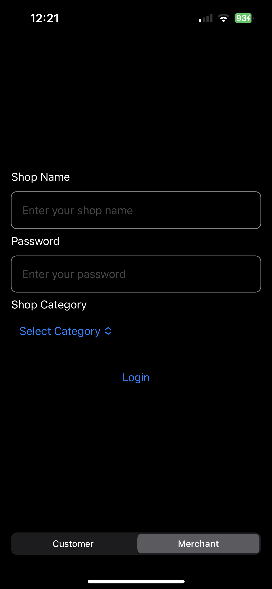
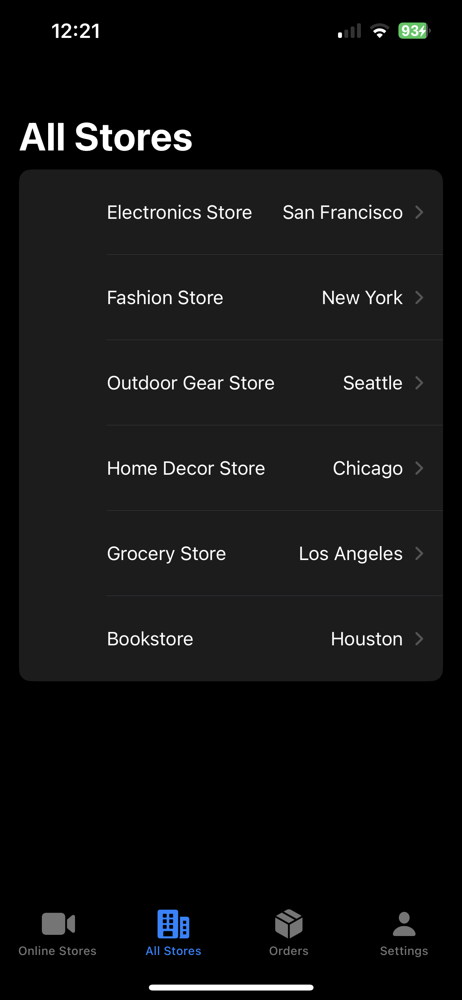
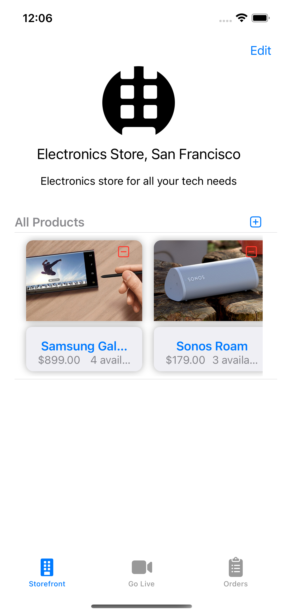
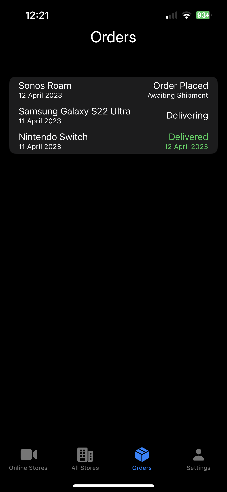
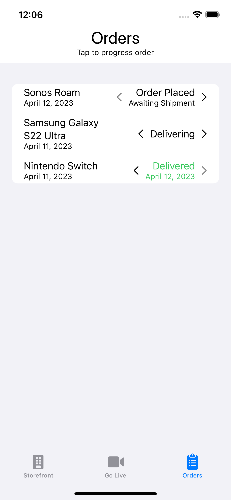
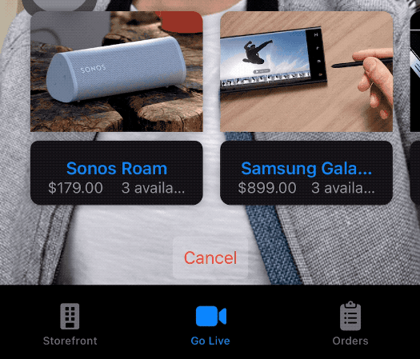
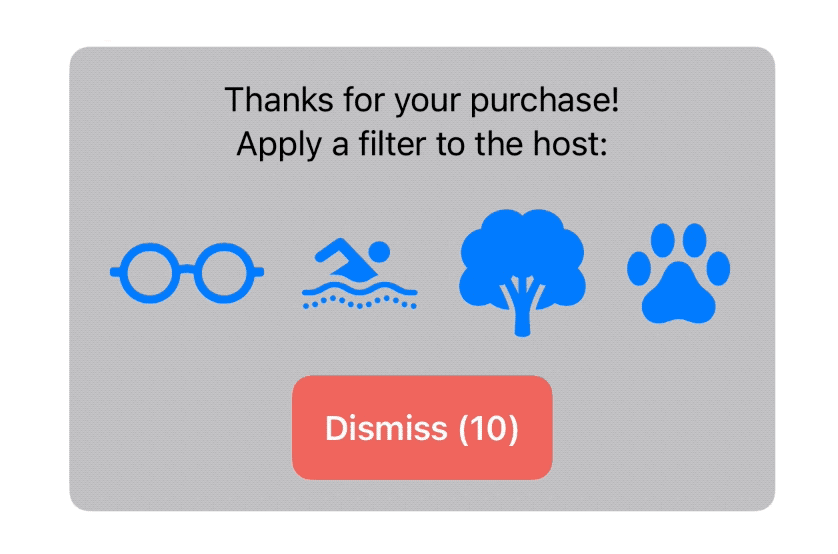

# Building a Live Streaming E-Commerce App

Live streaming commerce is an emerging trend that blends live video broadcasting with e-commerce to create engaging and interactive shopping experiences. With the rise of platforms like live commerce, building your own live streaming shopping app is easier than ever.

In this guide, we'll walk through the key components and considerations for building a live streaming e-commerce app.

## Core Features

Some of the core features you'll want to include:

- **Live video streaming** - Enable sellers to broadcast live video where they can showcase and promote products. Agora is the ideal platform that can handle the streaming at scale.
- **Product catalog** - Allow sellers to upload and manage product listings that customers can browse and purchase from.
- **Shopping cart and checkout** - Customers need an easy way to add products to a cart and complete purchases. Integrate a payment gateway like Stripe.
- **Host tools** - Provide broadcasters tools to engage viewers like sharing product links, enabling AR effects, and moderating chat.
- **Viewer features** - Give customers features to interact like chat, reactions, filters and more.

## Key Technology Decisions

Building a live streaming app requires some key technology choices:

- **Live video platform** - As mentioned above, you'll want a robust and scalable platform like Agora as your streaming backbone. Agora's record on features like latency, quality, capacity and more should fit your app's needs.
- **E-commerce integrations** - You may want to integrate e-commerce platforms like Shopify or custom product databases so sellers can manage inventory and sales.
- **Payment processing** - Pick a payment gateway like Stripe or Braintree to handle secure checkout and transaction processing.
- **Real-time messaging** - Enable low latency chat and interactions using solutions like Agora Signaling.
- **Web/mobile SDKs** - To build cross-platform apps, leverage SDKs for building on web, iOS, Android, etc.

## User Roles

There are two primary user roles in a live streaming commerce app:

### Sellers/Hosts

Sellers are the broadcasters who host live video streams to showcase and sell products. Consider seller needs:
- Managing products/inventory
- Broadcasting live video
- Engaging viewers with chat, AR, etc.
- Tracking sales and revenue

### Customers/Viewers

Customers are the viewers who watch live streams and purchase products. Customer needs include:
- Browsing products and sellers
- Watching live video streams
- Chat and interact with hosts/other viewers
- Easy checkout and payments

Understanding these core roles will inform both your feature set and UI/UX design.

## User Flow Diagram

In this diagram, you can see that right from the start there are two main scenarios: a customer scenario and a merchant scenario.

The customer has the option to see live stores, their own orders, and all available stores. They also have the option to buy products from stores.

Merchants can see orders made on their store, view their storefront for actions such as updating stock, and live broadcast to all available customers.

## App Screens

| Customer Login | Merchant Login | No Stores Live | Stores Live |
|:-:|:-:|:-:|:-:|
|  |  |  |  |

| All Stores | Storefront | Customer Orders Tab | Merchant Orders Tab |
|:-:|:-:|:-:|:-:|
|  |  |  |  |

| Go Live View | Choose Product | Buy Product |
|:-:|:-:|:-:|
|  |  |  |

| Choose Filter | Banuba Filter |
|:-:|:-:|
|  |  |

## Agora Overview

The Agora SDK provides the core live streaming capabilities for enabling video broadcasting and viewing in a live e-commerce app.

Some ways the Agora SDK can be leveraged:

### Enabling Host Broadcasting

Use the Agora RTM and RTC SDKs to allow hosts to stream video. Key steps:

- Initialize the RTC client, join channel and enable camera/mic to start broadcasting
- Use RTM for signaling to notify viewers when stream starts
- Display low-latency video stream in app using Agora video views

    

The above steps could be achieved at ease using Agora's Video UI Kits, which are available for all platforms.

### Viewer Watching

Allow viewers to watch live streams in a couple ways:

- Create video view components in app to play remote streams
- Listen for RTM messages to detect when new streams start
- Bind video views to play host's broadcast streams

The above steps can again be achieved at ease using Agora's Video UI Kits, which are available for all platforms.

### Interactive Features

Agora enables engaging interactive features through the [Signaling SDK](https://docs.agora.io/en/signaling/overview/product-overview):

- Send RTM signals between host and viewers to sync interactions
- Host can use RTM to push product links, chat, AR effects to viewers
- Viewers can respond with chat messages, reactions, and more

    

All messages can be sent in whatever format you wish, such as a JSON string which can be encoded/decoded with any structure you desire.

## Integrating Other Services

Use Agora in conjunction with:

- An e-commerce platform such as Shopify for product management and checkout
- AR SDKs like Banuba for augmented reality effects, using [Agora's Extension Marketplace](https://www.agora.io/en/agora-extensions-marketplace/)
- Payments gateway like Stripe to process transactions

The Agora SDK handles the complex video streaming while you integrate e-commerce and interactive features.

| Choose Filter | Purchase Complete |
|:-:|:-:|
|  |  |

## Conclusion

Live streaming commerce blends interactive video with robust e-commerce capabilities to reimagine shopping.

The key is leveraging solutions like Agora for low-latency video streaming and engagement features. Integrate e-commerce platforms for product management and payment gateways for seamless checkout.

Carefully design experiences catered to seller broadcasting and customer engagement. Focus on immersive interactive features to complement live video.

With the right real-time video, commerce, and engagement building blocks, you can build innovative and powerful live shopping experiences.
