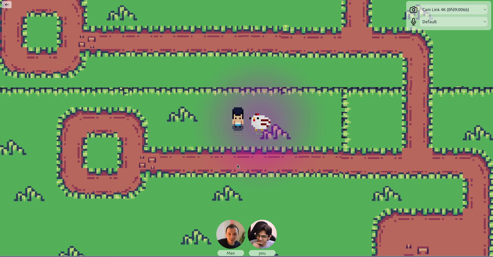
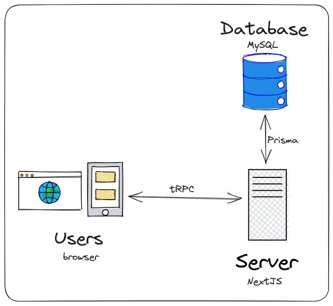

# Agora Virtual Space

The Agora Virtual Space is a demo of a web app where users can sign up to join a 2D virtual space. Users can create a space or join existing ones. While in the 2D space, users get assigned a character that they can move around on the screen. When near other users in that space, they can share voice & video with other users in real-time.

> Here's a [live demo](https://agora-virtualspace.vercel.app/)

## Screenshots
### Home

### Create Room

### View Rooms

### VirtualSpace

## Features

| **Feature**            | **Description**                                                                  |
| ---------------------- | -------------------------------------------------------------------------------- |
| OAuth                  | Uses NextAuth for authentication                                                 |
| Space Management       | Create and join rooms                                                            |
| Virtual Environment    | A 2D environment that resembles an office or an event                            |
| User Avatar            | A 2D avatar that the user can move around in the virtual space with the keyboard |
| Data Synchronisation   | Sync locations across user                                                       |
| Animations             | Animate the avatar with a sprite sheet                                           |
| Voice Channel          | Ability for users to communicate with each other over voice                      |
| Video Feeds            | Display user videos                                                              |
| Agora Tokens           | Expose an API to secure rooms                                                    |
| Proximity Subscription | Ability to join a voice channel based on location proximity                      |
| User controls          | Ability to mute/unmute local audio/video feeds                                   |
| Mobile Support         | Works on mobile devices using gesture handler                                    |
| Deployment (CI/CD)     | Deploy the frontend and backend online                                           |

### OAuth
We're use Google OAuth to make signups easy, we store each user in a database along with their access/refresh tokens tied to their OAuth account. Only logged in user's are allowed to create and join spaces. On sign-up we also assign them unique IDs to use as Agora UIDs.
### Space Management
A signed-in user can create a virtual space, this equates to and Agora channel. We assign a channel ID to each space and store it in our database mapped to the user.
### Virtual Environment
We're creating a 2D virtual environment using a png sprite as the background - users can select a preferred map image for their space. This is drawn on the screen first behind all user interactions. We draw the user sprites on top of this layer. Finally, at the last layer we draw buttons and menus, things the user can click on. For example, muting and setting input devices for voice and video.
### User Avatar
A user is drawn as a _human_ sprite in the space. The sprite is redrawn every render cycle (~60 times a second) based on the user location as part of the application state.
### Data Synchronisation
We use the Agora RTM SDK to sync remote user locations. At every interval, all users in a space broadcast their location to the channel as an object with an x and y coordinate. The other users on receiving this message draw the remote sprite at that location interpolating between the previous location.
### Animations
We're using a spritesheet for animation, it's divided into sections for each animation like walking up, standing, walking left. Based on the difference of the current location from the previous location we assign a direction to the movement and user the direction to animate the user avatar.
### Voice Channel & Video Feeds
We're using the Agora RTC SDK to join a video channel, user's in the same space join the same channel and can subscribe to other users' audio and video.
### Agora Tokens
To secure our channels, we're using Agora Tokens - when a user joins a space, a request is made to our backend to generate a token for that space. This route can be protected or authorisation can be added to limit access. User's without a valid token cannot join the Agora channel.
### Proximity Subscription
After joining a space and subsequently an Agora channel. Based on the user location and any remote users in proximity we selectively subscribe to their audio/video feeds (if available). We check for proximity every render cycle.
### User controls
User's can control the character using the keyboard arrow keys, we attach event listeners for each keypress and modify the user location adding a speed vector to the direction pressed in the application state.
### Mobile Support
There's partial mobile support, user's can control their avatar by swiping along the screen but a lot of time wasn't spent to improve gestures.
### Deployment
The project contains a frontend, a backend server and a database that are all hosted on managed services.

## Diagrams
### Architecture

The application is built with Next.js so we have a monorepo for the frontend and the backend. The frontend uses React Three Fiber to render the 2D environment and the user avatars. The backend uses tRPC to expose an API to generate Agora tokens and manage user data. The frontend and backend are hosted on Vercel and the database is hosted on Planetscale. 
### User Flow

The user flow is simple, a user signs up using OAuth and is redirected to the home page. From here they can create a space or join an existing one. Once they join a space, they can move around their avatar with the keyboard and communicate with other users within their proximity.

### Running Locally
The source code is available on [GitHub](https://github.com/EkaanshArora/agora-virtualspace), it's built with:
- Agora RTC and RTM SDKs
- React
- Next.js
- React Three Fiber
- Prisma
- tRPC
- NextAuth (GitHub)

To run the project locally:
- Rename `.env.example` to `.env` and fill in the required details
- Execute `pnpm i` (if you don't hav pnpm install with `npm i -g pnpm`)
- Execute `pnpm run dev` to start a server on port `3000`
- Visit [localhost:3000](http://localhost:3000) in your browser
